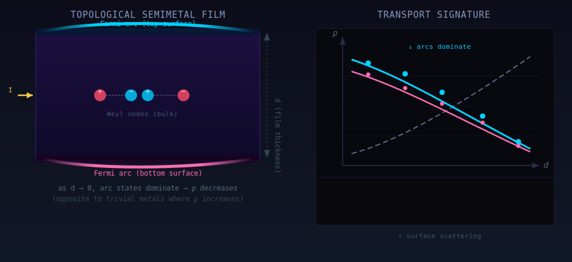
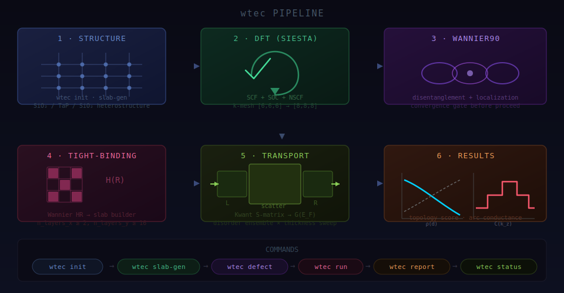
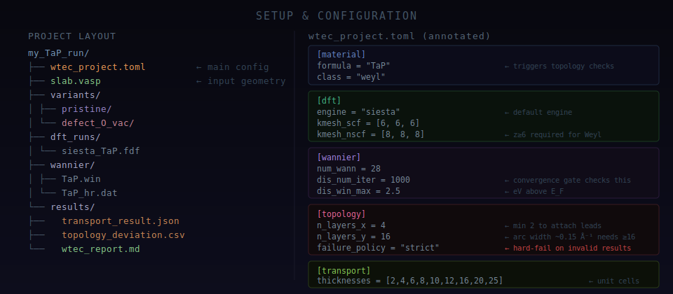
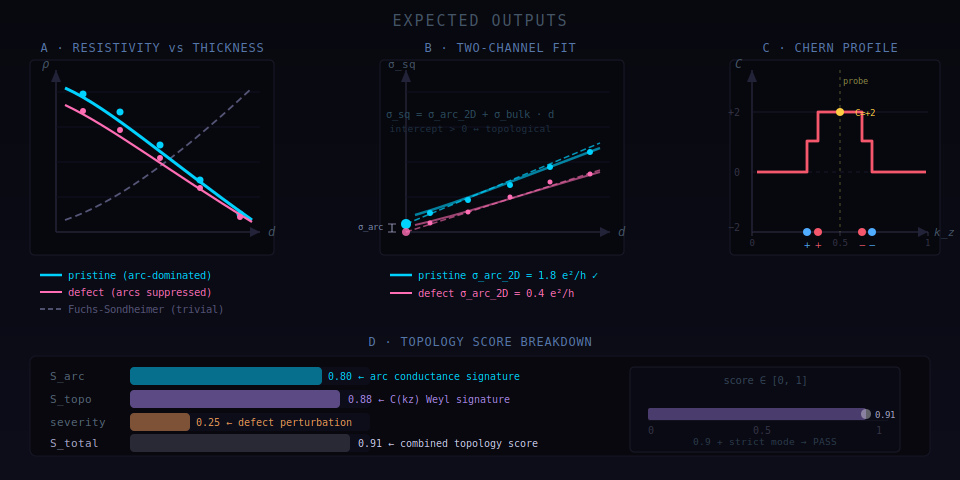

# wtec

**Wannier tight-binding electronic transport calculator** for topological semimetal thin films.

wtec answers a single material-science question with a full first-principles chain:

> *Does this film carry Fermi-arc surface currents that grow stronger as the film gets thinner—
> the definitive hallmark of a topological Weyl semimetal?*

It automates every step from crystal geometry to a scored transport report, running heavy DFT and
transport stages on a PBS cluster with MPI, enforcing scientific validity at every boundary.

---

## Physics basis



A Weyl semimetal hosts chiral bulk nodes connected by topological Fermi-arc surface states.
When a thin film is formed, arcs on the top and bottom surfaces carry current in parallel with the bulk.
As film thickness *d* decreases, the arc contribution grows relative to bulk, so resistivity *ρ* **decreases**—
the opposite of ordinary metals (Fuchs–Sondheimer: *ρ* rises as *d* → 0 due to surface scattering).

The quantitative signature is extracted by a two-channel fit:

```
σ_sq(d)  =  σ_arc_2D  +  σ_bulk · d
```

A positive y-intercept **σ_arc_2D > 0** with statistical significance (σ_arc > 2σ_err) is the
definitive topological identification. Defect variants suppress arc conductance, allowing controlled
contrast to confirm the arc origin rather than a measurement artifact.

---

## Pipeline



| Stage | Tool | Output |
|---|---|---|
| 1 · Structure | `wtec slab-gen` | SiO₂/TaP/SiO₂ slab POSCAR |
| 2 · DFT | SIESTA + SOC | Bloch wavefunctions, Fermi level |
| 3 · Wannier | Wannier90 | Maximally localised WFs, `_hr.dat` |
| 4 · Tight-binding | `wtec` H(R) builder | Kwant slab Builder |
| 5 · Transport | Kwant S-matrix | G(E_F) per thickness, disorder ensemble |
| 6 · Topology | Berry flux | C(k_z) staircase, arc conductance |

All heavy stages (DFT, Wannier, transport ensemble, topology scan) are submitted through **PBS/qsub**
with `mpirun`. No fork-based parallelism. The orchestrator checkpoints after each stage and resumes
cleanly after cluster interruption.

---

## Setup



### Requirements

```
Python ≥ 3.10
SIESTA  (MPI build, with SOC pseudopotentials)
Wannier90 ≥ 3.1
kwant ≥ 1.4
mpi4py, numpy, scipy, matplotlib
```

### Quick start

```bash
pip install -e .

# 1. Initialise project
wtec init --material TaP --class weyl my_TaP_run/
cd my_TaP_run/

# 2. Generate heterostructure slab
wtec slab-gen --substrate SiO2 --layers 4

# 3. Add defect variants (O vacancies at SiO2/TaP interface)
wtec defect --type vacancy --concentration 0.05

# 4. Submit full pipeline to PBS
wtec run

# 5. Generate report after completion
wtec report
```

### Key configuration knobs (`wtec_project.toml`)

```toml
[dft]
engine      = "siesta"          # or "qe" for override
kmesh_scf   = [6, 6, 6]         # z ≥ 6 required for Weyl (W1 at kz ≈ 0.42)
kmesh_nscf  = [8, 8, 8]

[wannier]
dis_num_iter = 1000             # convergence gate aborts before transport if not reached
dis_win_max  = 2.5              # eV above E_F

[topology]
n_layers_x    = 4               # minimum 2 to attach Kwant leads
n_layers_y    = 16              # arc k-width ≈ 0.15 Å⁻¹ requires ≥ 16 unit cells
failure_policy = "strict"       # hard-fail on any invalid/missing metric

[transport]
thicknesses  = [2,4,6,8,10,12,16,20,25]   # unit cells covering arc → bulk regimes
disorder_strength    = 1.0                 # Anderson W (eV)
surface_disorder_strength = 2.0           # enhanced at SiO₂/TaP interface layers
```

---

## Expected outputs



### ρ(d) resistivity scan

Two resistivity curves (pristine + defect) are plotted against the Fuchs–Sondheimer trivial reference.
The topological identification requires the pristine curve to **decrease** while the FS reference
**increases** as *d* → 0. The separation between pristine and defect quantifies how strongly
interface defects scatter the arc states.

### Two-channel fit

A linear fit of sheet conductance σ_sq(*d*) = σ_arc_2D + σ_bulk·*d* extracts the arc surface
conductance σ_arc_2D (e²/h). Values significantly above zero confirm topological transport.
The defect variant's lower intercept measures defect-induced arc suppression.

### Chern number profile C(k_z)

Berry flux integrated over k_x–k_y plaquettes at each k_z slice gives the Chern staircase.
For TaP: C jumps +1 at each W1 Weyl node (k_z ≈ 0.32, 0.38 × 2π/c), reaches a plateau C = +2
between the W1 and W2 pairs, then steps back to 0. A non-zero plateau at k_z = 0.5 is the
Wannier topology validation gate (hard-fail if |C| < 0.5 for `class = "weyl"`).

### Topology score

```
S_arc      — arc conductance signature (σ_arc_2D intercept strength)
S_topo     — Chern number evidence (|C(0.5)| normalised)
severity   — defect perturbation level (O vacancies / total interface atoms)
S_total    — combined score ∈ [0, 1]; S_total ≥ 0.7 + strict → PASS
```

---

## Scientific guardrails

wtec enforces hard stops at every stage where a silent failure would produce a physically
meaningless result:

| Guard | Condition | Error |
|---|---|---|
| Geometry | `n_layers_x < 2` | `ValueError` — leads cannot attach |
| Geometry | `n_layers_y < 16` for Weyl | `ValueError` — arcs not resolved |
| Wannier | max-iteration warning in `.wout` | `WannierNotConvergedError` — abort before transport |
| k-mesh | `kmesh_nscf[2] < 6` for Weyl | `ValueError` — W1 node at k_z≈0.42 under-sampled |
| Topology | `hr_scope = "shared"` | `ValueError` — pristine/defect must use distinct HR |
| Transport | lead attachment failure → G = 0 | `RuntimeError` — no silent zero fallback |
| Scoring | missing S_arc or node result | fail under `failure_policy = "strict"` |

---

## Cite / contact

Physics methodology: see `docs/wtec_physics_and_implementation.md`.
